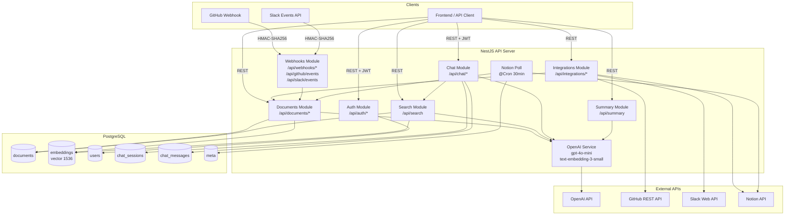
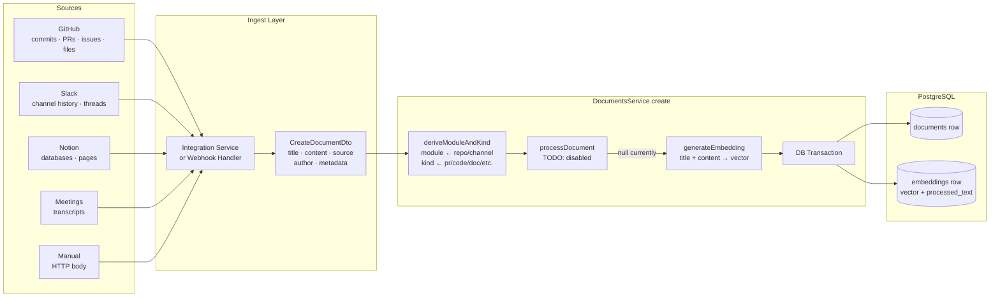
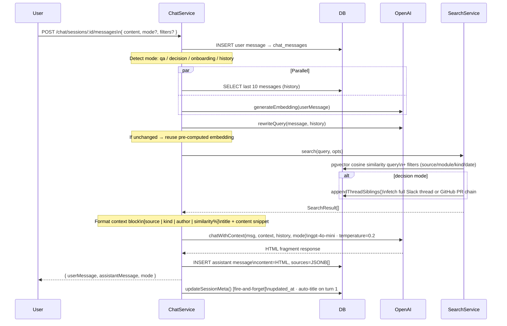
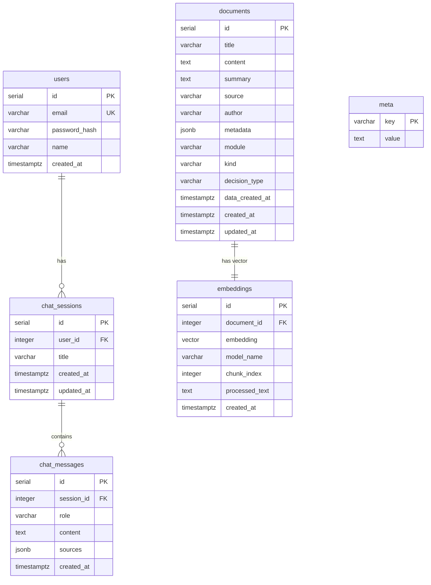

# Goldfish Backend — Architecture

**Project Memory** is a RAG-powered (Retrieval-Augmented Generation) knowledge engine for software teams. It ingests content from GitHub, Slack, Notion, and meeting transcripts, stores it as semantic vector embeddings, and lets authenticated users query it through a conversational AI chat interface.

---

## Diagrams

### 1. System Overview



---

### 2. Ingest Flow



---

### 3. Chat Pipeline



---

### 4. Database Entity Relationships



---

## Tech Stack

| Layer           | Technology                                                  |
| --------------- | ----------------------------------------------------------- |
| Framework       | NestJS 10 (TypeScript)                                      |
| Database        | PostgreSQL + `pgvector` extension                           |
| AI / Embeddings | OpenAI `gpt-4o-mini` + `text-embedding-3-small` (1536 dims) |
| Auth            | JWT (Passport) + bcryptjs                                   |
| Scheduled Jobs  | `@nestjs/schedule` (node-cron)                              |
| HTTP Client     | axios                                                       |
| Validation      | `class-validator` / `class-transformer`                     |

**Base URL:** `http://localhost:3002/api`

---

## High-Level Architecture

```
┌─────────────────────────────────────────────────────────────────────┐
│                          Client / Frontend                          │
└────────────────────────────────┬────────────────────────────────────┘
                                 │ HTTP (REST)
                                 ▼
┌─────────────────────────────────────────────────────────────────────┐
│                         NestJS API Server                           │
│                                                                     │
│  ┌──────────┐  ┌──────────┐  ┌──────────┐  ┌─────────────────────┐ │
│  │   Auth   │  │Documents │  │  Search  │  │       Chat          │ │
│  │ /auth/*  │  │/documents│  │ /search  │  │ /chat/sessions/*    │ │
│  └──────────┘  └──────────┘  └──────────┘  └─────────────────────┘ │
│                                                                     │
│  ┌──────────────────────────┐  ┌──────────────────────────────────┐ │
│  │      Integrations        │  │           Webhooks               │ │
│  │ /integrations/{source}/* │  │ /webhooks/* | /slack/* /github/* │ │
│  └──────────────────────────┘  └──────────────────────────────────┘ │
│                                                                     │
│  ┌──────────────────────────────────────────────────────────────┐   │
│  │                     OpenAI Service                           │   │
│  │  generateEmbedding · chatWithContext · rewriteQuery ·        │   │
│  │  processDocument · summarize                                 │   │
│  └──────────────────────────────────────────────────────────────┘   │
└──────────────────────┬──────────────────────┬───────────────────────┘
                       │                      │
                       ▼                      ▼
          ┌────────────────────┐   ┌──────────────────────┐
          │    PostgreSQL DB   │   │      OpenAI API       │
          │  documents         │   │  gpt-4o-mini          │
          │  embeddings        │   │  text-embedding-3-    │
          │  users             │   │  small (1536 dims)    │
          │  chat_sessions     │   └──────────────────────┘
          │  chat_messages     │
          │  meta              │
          └────────────────────┘
```

---

## Module Structure

```
src/
├── app.module.ts               Root module — wires all feature modules
├── main.ts                     Bootstrap: CORS, ValidationPipe, global /api prefix
├── health.controller.ts        GET /health → { status: 'ok', timestamp }
│
├── database/                   PostgreSQL connection layer (@Global)
│   ├── database.service.ts     Thin pg.Pool wrapper (query / getPool)
│   ├── database.tokens.ts      PG_POOL injection token
│   ├── migrate.ts              Migration runner script
│   └── schema.sql              Full DB schema (tables, indexes, backfills)
│
├── auth/                       JWT authentication
│   ├── auth.controller.ts      POST /auth/register · /login · GET /auth/me
│   ├── auth.service.ts         bcrypt hashing, JWT signing
│   ├── strategies/             Passport JWT strategy (Bearer token)
│   └── guards/                 JwtAuthGuard
│
├── openai/                     OpenAI API abstraction
│   └── openai.service.ts       All AI interactions (see below)
│
├── documents/                  Core document storage
│   ├── documents.controller.ts CRUD + seed endpoints
│   └── documents.service.ts    create · seed · seedBulk · findAll · findOne · remove
│
├── search/                     Semantic vector search
│   └── search.service.ts       Cosine similarity via pgvector, filters, thread expansion
│
├── summary/                    On-demand summarization
│   └── summary.service.ts      Calls OpenAI summarize, optionally persists to DB
│
├── chat/                       Conversational AI
│   ├── chat.service.ts         Core RAG pipeline (see Chat Pipeline below)
│   ├── timeline.service.ts     Chronological event feed with facets
│   └── experts.service.ts      Author ranking: relevance × recency decay
│
├── integrations/               One-shot bulk ingest adapters
│   ├── slack/                  Fetches channel history + threads from Slack API
│   ├── github/                 Fetches commits, PRs, issues, doc files from GitHub API
│   ├── notion/                 Fetches pages and databases from Notion API
│   └── meetings/               Accepts structured meeting transcripts
│
└── webhooks/                   Real-time event ingest + scheduled polling
    ├── github-webhook.service.ts   push / pull_request / issue_comment events
    ├── slack-webhook.service.ts    message events (URL verification + HMAC)
    └── notion-poll.service.ts      @Cron every 30 min — polls for updated pages
```

---

## Database Schema

### `documents` — Primary knowledge store

```sql
id              SERIAL PRIMARY KEY
title           VARCHAR(500) NOT NULL
content         TEXT NOT NULL
summary         TEXT                          -- LLM-generated (optional)
source          VARCHAR(100) DEFAULT 'manual' -- github | slack | notion | meeting | seed | manual
author          VARCHAR(200)
metadata        JSONB DEFAULT '{}'            -- source-specific fields (sha, pr_number, thread_ts, etc.)
module          VARCHAR(200)                  -- repo name | Slack channel | Notion DB ID
kind            VARCHAR(50)  DEFAULT 'note'   -- pr | code | issue | thread | message | doc | decision | note
decision_type   VARCHAR(50)
data_created_at TIMESTAMPTZ                   -- original event date (not ingestion date)
created_at      TIMESTAMPTZ DEFAULT NOW()
updated_at      TIMESTAMPTZ DEFAULT NOW()
```

### `embeddings` — Vector index

```sql
id             SERIAL PRIMARY KEY
document_id    INTEGER FK → documents(id) ON DELETE CASCADE
embedding      vector(1536)    -- text-embedding-3-small output
model_name     VARCHAR(100)
chunk_index    INTEGER DEFAULT 0
processed_text TEXT            -- clean text that was embedded; NULL = raw title+content
created_at     TIMESTAMPTZ DEFAULT NOW()
```

### `users`

```sql
id            SERIAL PRIMARY KEY
email         VARCHAR(255) UNIQUE NOT NULL
password_hash VARCHAR(255) NOT NULL
name          VARCHAR(100)
created_at    TIMESTAMPTZ DEFAULT NOW()
```

### `chat_sessions`

```sql
id         SERIAL PRIMARY KEY
user_id    INTEGER FK → users(id) CASCADE
title      VARCHAR(500) DEFAULT 'New Chat'
created_at TIMESTAMPTZ DEFAULT NOW()
updated_at TIMESTAMPTZ DEFAULT NOW()
```

### `chat_messages`

```sql
id         SERIAL PRIMARY KEY
session_id INTEGER FK → chat_sessions(id) CASCADE
role       VARCHAR(20) CHECK IN ('user', 'assistant')
content    TEXT NOT NULL          -- HTML fragment for assistant messages
sources    JSONB DEFAULT '[]'     -- array of cited document snippets
created_at TIMESTAMPTZ DEFAULT NOW()
```

### `meta` — Key-value polling state

```sql
key   VARCHAR(255) PRIMARY KEY
value TEXT NOT NULL
-- e.g. key = 'notion_last_poll_{database_id}'
```

### Key Indexes

| Index                              | Type                       | Purpose                 |
| ---------------------------------- | -------------------------- | ----------------------- |
| `idx_embeddings_vector`            | IVFFlat cosine (lists=100) | ANN vector search       |
| `idx_documents_metadata_gin`       | GIN on JSONB               | Fast `->>'key'` queries |
| `idx_documents_module/kind/author` | B-tree                     | Filtered search         |
| `idx_documents_created_at`         | B-tree DESC                | Timeline ordering       |

---

## API Endpoints

### Auth

| Method | Path                 | Auth | Description                  |
| ------ | -------------------- | ---- | ---------------------------- |
| POST   | `/api/auth/register` | —    | Register → `{ user, token }` |
| POST   | `/api/auth/login`    | —    | Login → `{ user, token }`    |
| GET    | `/api/auth/me`       | JWT  | Current user                 |

### Documents

| Method | Path                       | Auth | Description                  |
| ------ | -------------------------- | ---- | ---------------------------- |
| POST   | `/api/documents`           | —    | Create + embed document      |
| POST   | `/api/documents/seed`      | —    | Seed from raw text           |
| POST   | `/api/documents/seed/bulk` | —    | Bulk seed array              |
| GET    | `/api/documents`           | —    | List (limit 50)              |
| GET    | `/api/documents/:id`       | —    | Single document              |
| DELETE | `/api/documents/:id`       | —    | Delete (cascades embeddings) |

### Search

| Method | Path          | Auth | Description                                       |
| ------ | ------------- | ---- | ------------------------------------------------- |
| POST   | `/api/search` | —    | `{ query, limit?, threshold? }` → `{ results[] }` |

### Chat — All JWT protected

| Method | Path                                                 | Description                                  |
| ------ | ---------------------------------------------------- | -------------------------------------------- |
| POST   | `/api/chat/sessions`                                 | Create session                               |
| GET    | `/api/chat/sessions/list`                            | Sidebar list (count + HTML-stripped preview) |
| GET    | `/api/chat/sessions/:id/history`                     | Paired turn-by-turn history                  |
| POST   | `/api/chat/sessions/:id/messages`                    | **Main chat pipeline**                       |
| DELETE | `/api/chat/sessions/:id`                             | Delete session                               |
| GET    | `/api/chat/sessions/:sid/messages/:mid/sources/:idx` | Expand citation to full thread/PR            |
| GET    | `/api/chat/timeline`                                 | Chronological event feed with facets         |
| GET    | `/api/chat/experts?topic=`                           | Expert finder (author ranking)               |

### Integrations (bulk ingest, no auth)

| Method | Path                                | Description                            |
| ------ | ----------------------------------- | -------------------------------------- |
| POST   | `/api/integrations/slack/ingest`    | Ingest Slack channel history           |
| POST   | `/api/integrations/github/ingest`   | Ingest GitHub commits/PRs/issues/files |
| POST   | `/api/integrations/notion/ingest`   | Ingest Notion database or page         |
| POST   | `/api/integrations/meetings/ingest` | Ingest meeting transcripts             |

### Webhooks (signature-verified, no auth)

| Method | Path                        | Description                                   |
| ------ | --------------------------- | --------------------------------------------- |
| POST   | `/api/github/events`        | GitHub push / PR / issue_comment events       |
| POST   | `/api/slack/events`         | Slack Events API (message + url_verification) |
| POST   | `/api/webhooks/notion/poll` | Manual Notion poll trigger                    |

---

## Core Data Flows

### 1. Ingest Flow (all sources)

```
External Source (GitHub API / Slack API / Notion API / HTTP body)
    │
    ▼
Integration Service or Webhook Handler
    │  builds CreateDocumentDto { title, content, source, author, metadata, ... }
    ▼
DocumentsService.create()
    ├── deriveModuleAndKind()        — infers module (repo/channel) and kind (pr/code/doc/etc.)
    │
    │   [TODO: processDocument()]   — AI relevance filter + clean text extraction (disabled)
    │
    ├── OpenAIService.generateEmbedding(title + content)
    │
    └── DB Transaction:
            INSERT INTO documents   → returns DocumentRow
            INSERT INTO embeddings  → stores vector + processed_text
```

### 2. Chat Pipeline (POST `/api/chat/sessions/:id/messages`)

```
Authenticated User
    │
    │  { content, mode?, limit?, threshold?, filters? }
    ▼
ChatService.sendMessage()
    │
    ├─ STEP 1 ── Save user message to chat_messages
    │
    ├─ STEP 2 ── Mode detection (if not supplied)
    │             keywords → qa | decision | onboarding | history
    │
    ├─ STEP 3 ── Build SearchOptions from mode defaults + caller filters
    │
    ├─ STEP 4a ─ [PARALLEL]
    │             ├─ DB: fetch last 10 messages (conversation history)
    │             └─ OpenAI: generateEmbedding(userMessage) ← pre-computed
    │
    ├─ STEP 4b ─ OpenAI: rewriteQuery(message, history)
    │             → if unchanged: reuse pre-computed embedding (saves 1 API call)
    │             → if rewritten: new embedding generated inside search
    │
    ├─ STEP 4c ─ SearchService.search()
    │             ├─ pgvector cosine similarity with filters
    │             ├─ [decision mode] appendThreadSiblings()
    │             │     fetches full Slack thread / GitHub PR+comment chain
    │             │     for high-similarity results (≥ 0.3); appended with similarity=0
    │             └─ resolveSourceUrl() → builds GitHub/Slack deep-links per result
    │
    ├─ STEP 5 ── Format context block
    │             [source | kind | module | author | date | similarity%]
    │             Title + first 800 chars of content
    │             [history mode: sorted chronologically]
    │
    ├─ STEP 6 ── OpenAI: chatWithContext(userMessage, contextBlock, history, mode)
    │             temperature=0.2, gpt-4o-mini
    │             Mode-specific system prompts:
    │               qa          → standard RAG, cite [Source N]
    │               decision    → who/what/when decided, alternatives, dissent, trade-offs
    │               onboarding  → file paths, function names, data flow, entry points
    │               history     → chronological grouping, who reported/resolved
    │             Response format: HTML fragment (not Markdown)
    │
    ├─ STEP 7 ── Save assistant message
    │             INSERT chat_messages(role='assistant', content=HTML, sources=JSONB[])
    │
    └─ STEP 8 ── [fire-and-forget] updateSessionMeta()
                  UPDATE updated_at, auto-title from first 80 chars on turn 1

Return: { userMessage, assistantMessage, mode }
```

### 3. Notion Poll (Cron — every 30 minutes)

```
@Cron(EVERY_30_MINUTES)
    │
    ├── Read NOTION_POLL_DATABASES from env
    ├── For each database ID:
    │     ├── SELECT last_poll_time FROM meta
    │     ├── Notion API: query pages where last_edited_time > last_poll_time
    │     ├── For each updated page:
    │     │     ├── Check if notion_id already in documents
    │     │     ├── If exists → DELETE old doc (cascades embedding)
    │     │     ├── Fetch page blocks → extract plain text
    │     │     └── DocumentsService.create() → embed + store
    │     └── Upsert new last_poll_time into meta
    └── Logs count of ingested pages
```

---

## Auth Flow

```
POST /api/auth/register
  ├── Check email uniqueness
  ├── bcrypt.hash(password, rounds=12)
  ├── INSERT INTO users
  └── Return { user, token: JWT(sub=id, email, exp=7d) }

POST /api/auth/login
  ├── SELECT user WHERE email = ?
  ├── bcrypt.compare(password, hash)
  └── Return { user (no hash), token: JWT }

Protected routes (chat only):
  JwtAuthGuard → PassportStrategy(jwt)
    → ExtractJwt.fromAuthHeaderAsBearerToken()
    → Verify signature with JWT_SECRET
    → DB lookup by sub → attach to req.user
```

> **Note:** Documents, search, and summary endpoints are **not** JWT-protected. Only `/api/chat/*` requires authentication.

---

## OpenAI Service Functions

| Function                                   | Model                    | Purpose                                                               |
| ------------------------------------------ | ------------------------ | --------------------------------------------------------------------- |
| `generateEmbedding(text)`                  | `text-embedding-3-small` | Single text → 1536-dim vector                                         |
| `generateEmbeddings(texts[])`              | `text-embedding-3-small` | Batch embed (one API call)                                            |
| `chatWithContext(msg, ctx, history, mode)` | `gpt-4o-mini`            | RAG answer as HTML fragment                                           |
| `rewriteQuery(message, history)`           | `gpt-4o-mini`            | Rewrite vague follow-ups into self-contained queries                  |
| `summarize(text)`                          | `gpt-4o-mini`            | Summarize a document or raw text                                      |
| `processDocument(doc)`                     | `gpt-4o-mini`            | Relevance check + semantic distillation _(currently disabled — TODO)_ |

---

## Webhook Security

### GitHub

- **Verification:** HMAC-SHA256 of raw request body using `GITHUB_WEBHOOK_SECRET`
- **Header:** `x-hub-signature-256: sha256=<hex>`
- **Handled events:** `push` (commits + diffs), `pull_request` (opened/closed/sync + diff), `issue_comment` (created)
- **Response pattern:** 200 OK immediately, process async (within GitHub's 10s window)

### Slack

- **Verification:** HMAC-SHA256 of `v0:{timestamp}:{raw_body}` using `SLACK_SIGNING_SECRET`
- **Replay protection:** reject if `|now - timestamp| > 300s`
- **Handled events:** `url_verification` (challenge response), `message` (ignores bots, edits, subtypes)
- **Response pattern:** acknowledge within Slack's 3s window using `setImmediate` for async processing

---

## Document Classification

Every document is automatically tagged with `module`, `kind`, and optionally `decision_type`:

| `source`                         | `kind` values |
| -------------------------------- | ------------- |
| `github` (commit)                | `code`        |
| `github` (PR)                    | `pr`          |
| `github` (issue)                 | `issue`       |
| `slack` (thread)                 | `thread`      |
| `slack` (message)                | `message`     |
| `notion`                         | `doc`         |
| any (title has ADR/RFC/decision) | `decision`    |
| default                          | `note`        |

`module` is derived from: `metadata.repo` → `metadata.channel` → `metadata.database_id` → `null`

---

## Chat Modes

| Mode         | Auto-trigger keywords                                                    | What the LLM does                                                                                       |
| ------------ | ------------------------------------------------------------------------ | ------------------------------------------------------------------------------------------------------- |
| `qa`         | _(default)_                                                              | Standard RAG answer with `[Source N]` citations                                                         |
| `decision`   | "why did we", "decision", "trade-off", "alternatives", "concerns raised" | Decision archaeology: what/when/who decided, alternatives considered, dissent quoted, trade-offs listed |
| `onboarding` | "how does", "how do I", "walk me through", "where is", "onboard"         | Concrete explanation with file paths, function names, data flow steps                                   |
| `history`    | "has anyone", "ever seen", "previously", "in the past"                   | Chronological list of prior occurrences grouped by date                                                 |

Mode can be forced by passing `mode` in the request body.

---

## Expert Finder

Ranks team members by combined semantic relevance and recency on a topic.

**Score formula:**

```
score(author) = Σ [ similarity(doc) × e^( -ln2 × doc_age_ms / 180_days ) ]
                  over top-50 semantic matches
```

- 180-day half-life: recent contributions weighted ~2× more than 6-month-old ones
- Bot/anonymous authors excluded
- Returns top-N authors with their top contributing documents and source URLs

---

## Key Design Decisions

1. **Pre-computed embedding optimization** — User message embedding is generated in parallel with the history DB fetch. If `rewriteQuery` returns unchanged, the pre-computed embedding is injected directly into search, saving one OpenAI round-trip per non-contextual query.

2. **Thread expansion in decision mode** — Sibling documents sharing the same `thread_ts` (Slack) or `pr_number`/`issue_number` + `repo` (GitHub) are fetched and appended with `similarity=0`, giving the LLM full debate context without re-scoring irrelevant messages.

3. **HTML responses** — LLM answers are returned as HTML fragments (`<p>`, `<h3>`, `<ul>`, `<code>`, `<blockquote>`) rather than Markdown, ready for direct frontend rendering. Session list previews have HTML tags stripped via `regexp_replace`.

4. **processDocument() disabled** — The AI-powered relevance filter + semantic distillation pipeline exists in `OpenAIService.processDocument()` but is currently commented out (`TODO`) in all call sites. All documents are embedded raw as `title + content` until re-enabled.

5. **Dual webhook endpoints** — Both `/api/webhooks/{github,slack}` (legacy) and `/api/{github,slack}/events` (dedicated) co-exist and route to the same service methods.

6. **Global DatabaseModule** — `@Global()` makes `DatabaseService` available everywhere without explicit module imports.

---

## Environment Variables

```bash
# Required
DATABASE_URL            PostgreSQL connection string
OPENAI_API_KEY          OpenAI API key
JWT_SECRET              JWT signing secret (default: 'changeme')

# Optional
PORT                    Server port (default: 3000)
FRONTEND_URL            CORS origin (default: 'http://localhost:3002')

# Integrations (can also be passed per-request in body)
GITHUB_TOKEN            GitHub Personal Access Token
NOTION_TOKEN            Notion integration token
SLACK_TOKEN             Slack bot token (xoxb-...)

# Webhook security (verification skipped if unset)
GITHUB_WEBHOOK_SECRET   GitHub webhook secret
SLACK_SIGNING_SECRET    Slack app signing secret

# Notion polling
NOTION_POLL_DATABASES   Comma-separated Notion database IDs to auto-poll
```

---

## Running Locally

```bash
# Install dependencies
npm install

# Run DB migrations
npx ts-node src/database/migrate.ts

# Start dev server
npm run start:dev

# Build for production
npm run build
npm run start:prod
```
